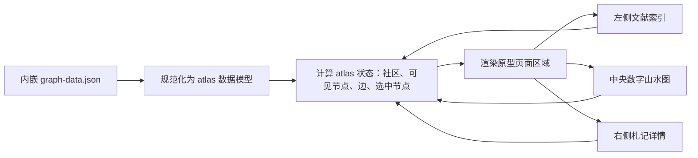

# refactor: 让图谱 HTML 对齐东方知识舆图原型

## Overview

这次重构的目标只有一个：`wiki/knowledge-graph.html` 生成后的页面，必须以 `docs/design/oriental-atlas/oriental-editorial-atlas.html` 为视觉和布局基准。不是把旧图谱页面继续换皮，也不是保留当前分支的“学习驾驶舱”壳子，而是把真实图谱数据和交互接进已经确认过的“东方编辑部 × 数字山水”原型。

允许做的适配只包括：读取真实 `graph-data.json`、处理节点很多时的密度、搜索/社区/聚焦/节点详情等交互，以及保证离线 HTML 可用。视觉风格、首屏布局、主要组件关系不重新发明。

---

## Problem Frame

用户已经明确认可 `oriental-editorial-atlas.html` 的效果，并期望正式生成的 HTML 也是这个效果。当前分支的方向错在把旧图谱壳保留下来，只做了部分视觉改造，导致四个核心问题：

- 页面骨架不是原型里的顶栏 + 左侧文献索引 + 中央画布 + 右侧札记三栏布局。
- 右侧详情仍然像隐藏抽屉，而不是桌面端常驻的札记栏。
- 节点渲染用了另一套 SVG/D3 卡片系统，没有保留原型的地图标注式节点语言。
- 测试只检查字符串和资源存在，无法阻止页面再次偏离原型。

因此，这份计划不是继续修补当前错误方向，而是把实现基准改回已批准的原型。

---

## Requirements Trace

- R1. 生成后的图谱 HTML 桌面首屏必须使用原型结构：`topbar`、`sidebar`、`canvas-card`、常驻 `drawer`。
- R2. 视觉必须保留“东方编辑部 × 数字山水”：宣纸底、墨色正文、朱砂强调、中文编辑排版、山水画布、右侧札记。
- R3. 页面仍由 `scripts/build-graph-html.sh` 生成，继续离线可用，继续读取内嵌 `graph-data.json`。
- R4. 节点多时要适配密度：小图谱用卡片节点，大图谱逐步变成紧凑卡片或点位，但选中、搜索命中、重点节点仍要可读。
- R5. 核心功能继续可用：搜索、社区筛选、聚焦、推荐起点、节点选择、弱化未选中、加载/空/错误状态、来源/详情动作。
- R6. 右侧详情以摘要和知识内容为主，相邻节点默认折叠，展开后内部可滚动。
- R7. 窄屏和移动端不能横向溢出，触控目标至少 44px，并保留能第一眼看到数字山水图谱的降级体验。
- R8. 测试必须能拦住回退到旧“学习驾驶舱”壳子的情况。
- R9. 不新增网络依赖、外部字体或大型前端框架。

---

## Scope Boundaries

- 不重新设计视觉方向；原型就是目标。
- 不保留当前分支的“学习驾驶舱”页面骨架作为正式结构。
- 不改上游 `graph-data.json` schema，除非运行时有兼容旧数据的兜底。
- 不新增第二套图谱风格，不恢复 classic/paper 多风格路线。
- 不只靠截图口头验收；需要结构测试、运行时测试和实际浏览器检查共同兜底。
- 不先追求完美图布局算法。视觉和布局对齐原型优先，节点坐标可以先采用确定性近似布局。

---

## Context & Research

### Relevant Code and Patterns

- `docs/design/oriental-atlas/oriental-editorial-atlas.html`：本次唯一视觉和布局基准，已经复制到当前实现分支。
- `docs/design/oriental-atlas/design-brief.md`：定义产品目标、必需结构、交互要求、约束和成功标准。
- `docs/design/oriental-atlas/DESIGN.md`：定义视觉 token、布局隐喻、组件状态、响应式行为和禁止方向。
- `docs/design/oriental-atlas/reviews/result-review.md`：记录原型已通过桌面、平板、移动端视觉检查，只需局部修正。
- `scripts/build-graph-html.sh`：当前离线图谱 HTML 构建入口，负责拼接 header、内嵌 graph data、拼接 footer、复制本地依赖。
- `templates/graph-styles/wash/graph-wash-helpers.js`：已有数据规范化、学习视图、搜索、localStorage 安全和可见快照相关 helper。
- `templates/graph-styles/wash/graph-wash.js`：已有部分运行时逻辑可复用，但渲染目标必须改成原型 DOM。
- `tests/graph-html-*.regression-1.sh` 和 `tests/js/graph-wash-*.test.js`：现有图谱回归测试体系。

### Institutional Learnings

- `docs/solutions/developer-experience/graph-style-simplification-to-wash-only-2026-04-20.md`：图谱必须视觉可读才算达标，自动化测试通过不等于用户可接受。
- `docs/solutions/ui-bugs/graph-wash-null-safety-and-label-truncation-fix-2026-04-21.md`：可选 DOM 区块必须判空，标签尺寸规则要集中，图谱测试不能只做静态 grep。

### External References

- 无。本次只依赖本地原型、设计文档和现有 vanilla HTML/CSS/JS 实现。

---

## Key Technical Decisions

- **以原型壳为基准，而不是修旧壳。** 先把原型的 DOM/CSS 移入 `header.html`，再接真实数据和交互。
- **继续使用 wash 输出路径。** 生成文件仍是 `wiki/knowledge-graph.html`，避免重新引入多风格复杂度。
- **节点渲染回到原型语言。** 中央画布用 HTML button 节点 + SVG 边，保留地图标注感；D3 只作为布局计算辅助，不决定最终组件形态。
- **桌面端右侧详情常驻。** 首屏就显示选中节点详情，不能默认隐藏成抽屉。
- **节点密度是视觉适配层。** 大图谱可以把低优先级节点压缩成紧凑卡片或点，但不能回到另一套视觉系统。
- **把视觉一致性纳入测试合同。** 测试要检查关键结构和中文标签，也要明确拒绝旧壳标记。
- **交付前必须实际打开页面看。** 这类工作最容易在视觉上跑偏，自动测试不能替代浏览器检查。

---

## Open Questions

### Resolved During Planning

- 是否继续保留当前分支的新布局，只加强东方感？不保留。目标是原型布局。
- 相邻节点是否默认展开？不默认展开，按用户批注保持折叠。
- 桌面端右侧详情是否仍是隐藏抽屉？不是，桌面端常驻。
- 节点卡片是否无论多少节点都保持大卡？不是，视觉风格不变，但密度要适配。

### Deferred to Implementation

- 缺少坐标的节点如何最终排布：实现时用确定性布局兜底，具体算法根据真实图谱分布确认。
- 是否需要把完整原型复制成测试 fixture：已解决。完整原型和设计资料固定在 `docs/design/oriental-atlas/`，测试再提炼 selector/token 合同。

---

## High-Level Technical Design

> *This illustrates the intended approach and is directional guidance for review, not implementation specification. The implementing agent should treat it as context, not code to reproduce.*

关键变化是渲染目标。数据读取、搜索、过滤、持久化等 helper 可以复用，但页面必须渲染进原型 DOM，而不是把原型样式套在旧 app grid 上。

### Atlas State Contract

实现时必须先形成一份共享的 atlas 状态，再渲染侧栏、画布、右栏和底部信息区。禁止每个区域各自派生社区、摘要、可见节点或边，否则搜索、筛选和节点详情会出现不一致。

| State | Owner | Contents | Rule |
|-------|-------|----------|------|
| `atlasModel` | `graph-wash-helpers.js` | 规范化后的 `meta`、`nodes`、`edges`、`communities`、`starts` | 原始 `graph-data` 只解析一次，所有缺字段兜底在这里完成 |
| `atlasLayout` | `graph-wash-helpers.js` | 节点 `x/y`、`degree`、`weight`、`priority`、密度输入 | 坐标必须确定性生成，不能每次刷新随机跳动 |
| `atlasUIState` | `graph-wash.js` | `selectedNodeId`、`activeCommunityId`、`focusMode`、`query`、`dimUnselected`、`dataMode`、`neighborExpanded` | 只存用户界面状态，不重新解释原始图谱 |
| `atlasVisibleSnapshot` | `graph-wash-helpers.js` | 当前可见 nodes、edges、搜索命中、推荐起点、密度模式、计数 | 搜索、社区、聚焦、弱化未选中都收敛到这一份快照 |
| DOM renderers | `graph-wash.js` | `renderSidebar`、`renderAtlasCanvas`、`renderDrawer`、`renderCanvasFooter` | 渲染函数只能消费状态，不能私自派生另一套模型 |

Helper 边界：

- `buildAtlasModel(rawGraph)`：读取并规范化原始图谱，派生社区、摘要、来源、置信度中文标签和推荐起点。
- `deriveAtlasLayout(atlasModel)`：计算稳定坐标、节点权重、显示优先级和密度输入。
- `resolveAtlasVisibleSnapshot(atlasModel, atlasLayout, atlasUIState)`：根据搜索、社区、聚焦和数据状态输出唯一可见快照。
- `renderAtlasView(atlasModel, atlasLayout, atlasUIState, atlasVisibleSnapshot)`：调用侧栏、画布、右栏、底部区域的纯渲染函数。

### Density Budget

节点很多时仍要像东方知识舆图，而不是退回另一套点线图。密度模式必须有明确阈值和浏览器预算：

| Node Count | Mode | Label Budget | Edge Budget | Browser Target |
|------------|------|--------------|-------------|----------------|
| 0-80 | `card` | 可见节点都显示地图标注卡片 | 可见边全部绘制 | 1440px 桌面无明显重叠，节点可读 |
| 81-200 | `compact-card` | 最多 120 个标签；其余低优先级节点缩短为小标注 | 可见边全部绘制，低权重边弱化 | 搜索、切社区、选节点反馈不超过 500ms |
| 201-500 | `point-plus-focus` | 最多 60 个标签；选中、搜索命中、高权重节点强制可读 | 最多 800 条边，优先保留选中邻域和高权重关系 | 1440px 下不白屏、不明显卡顿，交互反馈不超过 1s |
| >500 | `overview` | 最多 40 个标签；其余显示点位和聚合提示 | 最多 1000 条边，超出时只保留重点关系 | 页面仍可操作，并提示“当前视图过密，可搜索或筛选社区” |

代表性 fixture：

- `tests/fixtures/graph-interactive-basic/wiki/graph-data.json`：小图谱卡片模式。
- `tests/fixtures/graph-interactive-multicomm/wiki/graph-data.json`：多社区筛选和右栏同步。
- `tests/fixtures/graph-interactive-dense/wiki/graph-data.json`：新增约 200 节点 fixture，用于紧凑模式。
- 500 节点压力图谱可由测试临时生成，不需要长期维护巨型静态 HTML 期望文件。

---

## Implementation Units

- U0. **固定已批准原型资料到当前分支**

**Goal:** 让执行者只靠当前 worktree 就能读取视觉基准和设计约束，避免再凭记忆复刻未追踪设计工作区里的页面。

**Requirements:** R1, R2, R8

**Dependencies:** None

**Files:**
- Create/Keep: `docs/design/oriental-atlas/README.md`
- Create/Keep: `docs/design/oriental-atlas/oriental-editorial-atlas.html`
- Create/Keep: `docs/design/oriental-atlas/design-brief.md`
- Create/Keep: `docs/design/oriental-atlas/DESIGN.md`
- Create/Keep: `docs/design/oriental-atlas/reviews/result-review.md`

**Approach:**
- 将已批准的原型 HTML 和设计资料保存在 `docs/design/oriental-atlas/`，作为当前实现分支的唯一设计来源。
- `README.md` 明确这些文件的角色：原型 HTML 是视觉和结构基准，brief/DESIGN/review 是约束补充。
- 后续实现、测试和文档都引用 `docs/design/oriental-atlas/`，不再依赖未追踪设计工作区是否存在。
- 如果设计资料后续继续迭代，必须同步更新这个可追踪目录，再开始实现。

**Patterns to follow:**
- `docs/design/oriental-atlas/oriental-editorial-atlas.html`
- `docs/design/oriental-atlas/DESIGN.md`

**Test scenarios:**
- Happy path: 当前分支 checkout 后，`docs/design/oriental-atlas/oriental-editorial-atlas.html` 存在且可直接打开。
- Edge case: 计划、实现说明和测试脚本不再把未追踪设计工作区当作必需输入路径。

**Verification:**
- 执行前先用 `test -f docs/design/oriental-atlas/oriental-editorial-atlas.html` 确认基准文件存在。

---

- U1. **替换生成页骨架为原型结构**

**Goal:** 让生成后的 HTML 使用原型的顶栏、左侧文献索引、中央画布、画布底部信息区和右侧常驻札记栏。

**Requirements:** R1, R2, R8, R9

**Dependencies:** U0

**Files:**
- Modify: `templates/graph-styles/wash/header.html`
- Modify: `templates/graph-styles/wash/footer.html`
- Modify: `tests/graph-html-styles.regression-1.sh`
- Replace/Rename: `tests/graph-html-learning-cockpit.regression-1.sh`
- Modify: `tests/regression.sh`
- Create: `tests/graph-html-oriental-atlas-contract.regression-1.sh`

**Approach:**
- 将原型的结构移入 `header.html`：`main.app`、`header.topbar`、`aside.sidebar`、`section.canvas-card`、`aside.drawer`。
- 在原型顶栏里保留构建脚本需要替换的知识库标题、节点数、关系数、更新时间占位符。
- 删除或替换旧壳标记：`nav-panel`、独立 `.tools`、桌面端默认隐藏 drawer、非原型 footer stats。
- 在 U1 同步处理旧“学习驾驶舱”测试：删除或改名 `tests/graph-html-learning-cockpit.regression-1.sh`，把 `nav-panel`、`mode-switch`、`nav-close` 等旧结构断言替换为东方知识舆图结构断言。
- 同步更新 `tests/regression.sh`，确保总回归不会继续执行旧 cockpit 合同，也不会诱导实现者保留旧 id。
- 保持 `build-graph-html.sh` 的拼接边界：header 在 graph data 前，footer 在 graph data 后。
- CSS 继续本地自包含，不引入网络字体或外部资源。

**Patterns to follow:**
- `docs/design/oriental-atlas/oriental-editorial-atlas.html`
- `docs/design/oriental-atlas/DESIGN.md`
- `scripts/build-graph-html.sh`

**Test scenarios:**
- Happy path: 用基础 fixture 构建后，HTML 包含 `header.topbar`、`aside.sidebar`、`section.canvas-card`、`footer.canvas-footer`、桌面端 `aside.drawer`。
- Edge case: 生成页不包含 `学习驾驶舱`、`nav-panel`、`.tools`，也不在桌面端 drawer 上保留 `aria-hidden="true"` 默认隐藏状态。
- Regression guard: `tests/graph-html-learning-cockpit.regression-1.sh` 不再断言旧 cockpit 结构；总回归只接受 atlas shell。
- Integration: 生成页仍内嵌 `graph-data`，仍加载本地依赖，不出现 CDN 或字体网络地址。
- Visual contract: 顶栏副标题为 `国风知识库·数字山水图`，GitHub 按钮是图标 + `GitHub`，置信度标签为中文。

**Verification:**
- 打开生成页第一眼应接近原型，而不是旧图谱 app。

---

- U2. **把真实 graph-data 映射成 atlas 数据模型**

**Goal:** 不改上游数据格式，把现有 `graph-data.json` 转成原型运行时需要的数据。

**Requirements:** R3, R5, R9

**Dependencies:** U1

**Files:**
- Modify: `templates/graph-styles/wash/graph-wash-helpers.js`
- Modify: `templates/graph-styles/wash/graph-wash.js`
- Modify: `tests/js/graph-wash-helpers.test.js`
- Modify: `tests/js/graph-wash-learning.test.js`
- Modify: `tests/js/graph-wash-runtime-state.test.js`

**Approach:**
- 按 `Atlas State Contract` 实现共享状态边界：`buildAtlasModel` 只负责规范化，`deriveAtlasLayout` 只负责布局输入，`resolveAtlasVisibleSnapshot` 只负责可见快照。
- 将节点规范化为 atlas node：id、label、type、community、source path、confidence、summary、content、degree/weight、unavailable、可选 x/y。
- 有 `learning.communities` 时优先使用；没有时从节点的 `community` 派生社区列表。
- 节点没有 summary 时，从 content 中派生摘要；右侧知识内容继续走安全渲染。
- 边端点和置信度统一转换成原型里的边 class 和中文标签。
- 对缺字段数据保持兜底，避免稀疏 fixture 白屏。
- `renderSidebar`、`renderAtlasCanvas`、`renderDrawer` 必须消费同一份 `atlasVisibleSnapshot`，不能各自重新筛选节点或边。

**Patterns to follow:**
- `templates/graph-styles/wash/graph-wash-helpers.js`
- `tests/fixtures/graph-interactive-basic/wiki/graph-data.json`
- `tests/fixtures/graph-interactive-multicomm/wiki/graph-data.json`

**Test scenarios:**
- Happy path: 带 nodes、edges、learning communities 的图谱能填充社区、推荐起点、画布节点和右侧选中详情。
- Edge case: 没有 `learning` 的图谱仍能派生社区并选出初始节点。
- Edge case: 缺 `community`、`source_path`、`confidence` 或 `content` 的节点显示兜底文案，不抛错。
- Error path: content 含 `</script>` 或不安全 HTML 时，构建和详情渲染仍安全。
- Integration: 搜索索引覆盖 label、source path、summary、content。
- Contract: 同一查询和社区筛选下，侧栏计数、画布可见节点、右侧相邻节点都来自同一个 `atlasVisibleSnapshot`。

**Verification:**
- 运行时模型测试证明原型壳能被现有图谱数据填充。

---

- U3. **按原型语言渲染节点、边和密度模式**

**Goal:** 中央图谱保持数字山水原型效果，同时支持真实大图谱。

**Requirements:** R1, R2, R4, R5

**Dependencies:** U1, U2

**Files:**
- Modify: `templates/graph-styles/wash/header.html`
- Modify: `templates/graph-styles/wash/graph-wash.js`
- Modify: `templates/graph-styles/wash/graph-wash-helpers.js`
- Create: `tests/fixtures/graph-interactive-dense/wiki/graph-data.json`
- Modify: `tests/graph-html-density.regression-1.sh`
- Modify: `tests/graph-html-long-label.regression-1.sh`
- Modify: `tests/js/graph-wash-runtime-state.test.js`

**Approach:**
- 节点渲染到原型的 `#node-layer`，使用可点击的 atlas node 元素。
- 关系渲染到原型的 SVG `#edge-layer`。
- 保留原型状态：default、hover、selected、dimmed、hidden、disabled/unavailable、loading、empty、error。
- 标签截断和节点尺寸规则集中维护，避免紧凑模式溢出。
- 按 `Density Budget` 增加密度模式：
  - `card`：0-80 节点，正常地图标注卡片；
  - `compact-card`：81-200 节点，低优先级节点使用紧凑标注；
  - `point-plus-focus`：201-500 节点，低优先级节点变点位，选中、hover、搜索命中或高权重节点提升回可读卡片；
  - `overview`：超过 500 节点，控制标签和边数量，并引导用户搜索或筛选社区。
- 缺坐标时使用确定性布局，避免每次打开页面节点随机跳。

**Patterns to follow:**
- `docs/design/oriental-atlas/oriental-editorial-atlas.html`
- `docs/solutions/ui-bugs/graph-wash-null-safety-and-label-truncation-fix-2026-04-21.md`

**Test scenarios:**
- Happy path: 小图谱显示可读 atlas 卡片，包含类型、标签、元信息。
- Edge case: 200 节点 fixture 不把所有节点渲染成大卡片，而是进入紧凑或点位模式。
- Edge case: 500 节点临时压力图不白屏、不横向溢出、不绘制超过预算的标签和边。
- Edge case: 中文长标签和中英混合标签不会溢出节点边界。
- Edge case: 选中、hover、搜索命中的节点在密集模式下仍可读。
- Integration: 社区、搜索、聚焦变化时，节点和边的可见状态同步变化。

**Verification:**
- 图谱不再出现“大卡片把画面塞满”的问题，同时视觉仍像原型。

---

- U4. **重建右侧常驻详情栏**

**Goal:** 右侧区域回到原型的札记详情栏，而不是旧的隐藏抽屉。

**Requirements:** R1, R5, R6, R7

**Dependencies:** U1, U2

**Files:**
- Modify: `templates/graph-styles/wash/header.html`
- Modify: `templates/graph-styles/wash/graph-wash.js`
- Modify: `tests/graph-html-drawer-neighbors.regression-1.sh`
- Modify: `tests/graph-html-mobile.regression-1.sh`
- Modify: `tests/graph-html-a11y.regression-1.sh`

**Approach:**
- 桌面端右侧详情栏常驻，并显示当前选中节点。
- 内容顺序为：摘要、知识内容、相邻节点、札记和操作。
- 相邻节点使用原型的 `details.neighbor-section`，默认折叠。
- 展开相邻节点后限制高度并内部滚动，避免下面节点或操作按钮不可见。
- 知识内容继续用 `marked` + `DOMPurify` 安全渲染。
- 移动端按原型降级为堆叠区块，而不是桌面隐藏抽屉。

**Patterns to follow:**
- `docs/design/oriental-atlas/oriental-editorial-atlas.html`
- `docs/plans/2026-04-21-graph-ux-fixes-design.md`

**Test scenarios:**
- Happy path: 首屏右侧已经有选中节点标题、摘要和知识内容。
- Edge case: 相邻节点默认折叠，并且可展开。
- Edge case: 相邻节点很多时内部出现滚动，不把札记和操作区挤出可视范围。
- Error path: 节点缺少正文时显示明确兜底，不出现空白卡。
- Integration: 从画布、推荐起点、搜索结果或相邻节点点击节点，都更新同一个右侧详情栏。

**Verification:**
- 桌面端不应再出现空的、隐藏的、需要点击后才出现的详情区。

---

- U5. **把侧栏、画布控件和数据状态接入原型 UI**

**Goal:** 保留原型左侧文献索引和中央控制区，并接入真实运行时状态。

**Requirements:** R3, R5, R7, R8

**Dependencies:** U1, U2, U3, U4

**Files:**
- Modify: `templates/graph-styles/wash/header.html`
- Modify: `templates/graph-styles/wash/graph-wash.js`
- Modify: `tests/graph-html-search.regression-1.sh`
- Modify: `tests/graph-html-oriental-atlas-contract.regression-1.sh`
- Modify: `tests/graph-html-toolbar.regression-1.sh`
- Modify: `tests/graph-html-minimap.regression-1.sh`
- Modify: `tests/js/graph-wash-learning.test.js`

**Approach:**
- 保留原型中文区块：文献索引、社区、聚焦、学习队列、推荐起点；不再显示右侧英文小标题。
- 社区列表、聚焦按钮、搜索、推荐起点、学习队列摘要都绑定到规范化后的 atlas 状态。
- 这些控件只更新 `atlasUIState`，再通过 `resolveAtlasVisibleSnapshot` 驱动画布、右栏、小地图和计数一起刷新。
- 保留原型中央控件：回到全图、弱化未选中、正常/加载/空/错误。
- 无结果、加载、空、错误状态都要可见且文案明确。
- 保留画布底部三块：关系置信度、小地图、洞察，置信度显示中文。
- 移动端按钮和可点卡片至少 44px，并保留设计评审里要求的图谱预览体验。

**Patterns to follow:**
- `docs/design/oriental-atlas/reviews/result-review.md`
- `tests/graph-html-search.regression-1.sh`
- `tests/graph-html-minimap.regression-1.sh`

**Test scenarios:**
- Happy path: 输入节点名后筛选可见节点，并更新画布副标题。
- Edge case: 搜索无结果时显示无结果提示，不意外清空右侧选中内容。
- Edge case: 切换社区时，同步更新可见节点、侧栏 active 状态、画布标题、小地图和推荐起点。
- Error path: 空图谱显示空状态，而不是坏掉的画布。
- Integration: 状态按钮能切换 loading/empty/error 视觉状态，不破坏正常图谱状态。
- Mobile: 生成页 CSS 保证按钮和可点击目标不小于 44px。

**Verification:**
- 原型里的可见控件都能解释清楚，并且接上真实数据。

---

- U6. **补强视觉一致性测试和浏览器验收**

**Goal:** 防止再次出现“测试通过，但页面不像原型”的情况。

**Requirements:** R1, R2, R7, R8

**Dependencies:** U1, U3, U4, U5

**Files:**
- Create: `tests/graph-html-oriental-visual-contract.regression-1.sh`
- Modify: `tests/regression.sh`
- Modify: `tests/expected/graph-interactive-basic.html`
- Modify: `README.md`
- Modify: `README.en.md`
- Modify: `CHANGELOG.md`
- Modify: `SKILL.md`

**Approach:**
- 新增视觉合同回归，检查生成页包含原型关键 selector、中文标签，并明确拒绝旧壳标记。
- 只有当生成页已经使用原型壳后，才更新 expected HTML。
- 覆盖小图谱、多社区图谱、大图谱三类代表 fixture。
- 固定浏览器验收 fixture：
  - `tests/fixtures/graph-interactive-basic/wiki/graph-data.json` 验证首屏和右栏；
  - `tests/fixtures/graph-interactive-multicomm/wiki/graph-data.json` 验证社区、搜索和相邻节点；
  - `tests/fixtures/graph-interactive-dense/wiki/graph-data.json` 验证密度模式。
- 固定浏览器验收视口：桌面 `1440x900`、平板 `768x1000`、手机 `375x812`。
- 固定浏览器验收流程：
  - 打开生成页，确认无控制台错误、无横向溢出；
  - 搜索一个存在节点，确认侧栏、画布和右栏同步；
  - 切换社区，确认节点计数、小地图和推荐起点同步；
  - 点击画布节点，确认右侧常驻详情即时更新；
  - 展开相邻节点，确认区域内部可滚动且底部按钮仍可见；
  - 切换弱化未选中、加载、空、错误状态，确认能恢复正常图谱。
- 固定截图产物：`/tmp/llm-wiki-oriental-desktop.png`、`/tmp/llm-wiki-oriental-tablet.png`、`/tmp/llm-wiki-oriental-mobile.png`。
- 文档和 changelog 只描述最终确认后的东方知识舆图，不再描述错误方向的学习驾驶舱重构。

**Patterns to follow:**
- `tests/graph-html-styles.regression-1.sh`
- `tests/regression.sh`
- `docs/design/oriental-atlas/reviews/result-review.md`

**Test scenarios:**
- Happy path: 总回归测试包含新的东方知识舆图合同测试。
- Edge case: 如果生成页回到旧学习驾驶舱结构，合同测试失败。
- Edge case: 大图谱输出仍包含 atlas shell 和密度标记。
- Browser: 三个固定视口都保存截图，且截图里顶栏、左侧文献索引、中央数字山水图、右侧常驻札记在对应布局中可见。
- Browser: 节点选择、搜索、社区切换、相邻节点展开、状态切换五个流程均实际点击验证。
- Integration: README、英文 README、CHANGELOG、SKILL.md 的说明和最终页面一致。

**Verification:**
- 自动检查和浏览器检查都证明生成页已经对齐原型。

---

## System-Wide Impact

- **Interaction graph:** 搜索、社区筛选、聚焦、节点选择、相邻节点导航、推荐起点和状态按钮都更新同一份 atlas 状态。
- **Error propagation:** 缺少 graph data 仍由构建脚本失败；稀疏或部分异常的运行时数据则显示空/错误/兜底状态，不白屏。
- **State lifecycle risks:** 选中节点、可见节点集合、相邻节点折叠状态、学习队列状态必须在侧栏、画布和右栏之间保持一致。
- **API surface parity:** 输出路径、本地依赖、内嵌 `graph-data` 合同不变。
- **Integration coverage:** 页面骨架、数据规范化、画布渲染、右栏更新、侧栏交互、移动端行为都需要跨层测试。
- **Unchanged invariants:** 图谱仍是自包含本地 HTML，不依赖开发服务器、网络字体或新框架。

---

## Risks & Dependencies

| Risk | Mitigation |
|------|------------|
| 实现时又回到旧壳上做换皮 | U1 先替换结构，并增加旧壳标记的反向断言 |
| 大图谱导致原型卡片太拥挤 | U3 在同一视觉系统内做密度模式，压缩低优先级节点 |
| 结构测试仍证明不了视觉是否像 | U6 要求实际浏览器检查，同时用 selector/文案/状态合同兜底 |
| 真实 graph data 缺少原型里的坐标、摘要、权重 | U2 从现有数据派生兜底字段，并覆盖缺字段测试 |
| 常驻右栏在 13 寸屏上拥挤 | U1/U4 保留原型列宽逻辑，U5 覆盖窄屏降级 |
| CSS 精确断言太脆 | 合同测试检查稳定 selector、中文文案和行为 hook，不逐条锁死 CSS |

---

## Documentation / Operational Notes

- `CHANGELOG.md`、`README.md`、`README.en.md`、`SKILL.md` 只在浏览器预览确认后更新。
- 当前分支里错误方向的实现不能作为设计基准；只能复用不改变视觉壳的数据 helper 思路。
- 浏览器验收固定覆盖 `1440x900`、`768x1000`、`375x812` 三档，并确认无控制台错误、无横向滚动、顶栏/侧栏/画布/右栏可见、节点选择、搜索、社区切换、相邻节点展开和状态切换都可用。

---

## Sources & References

- Approved prototype: `docs/design/oriental-atlas/oriental-editorial-atlas.html`
- Design brief: `docs/design/oriental-atlas/design-brief.md`
- Visual system: `docs/design/oriental-atlas/DESIGN.md`
- Prototype review: `docs/design/oriental-atlas/reviews/result-review.md`
- Current builder: `scripts/build-graph-html.sh`
- Current template/runtime: `templates/graph-styles/wash/header.html`, `templates/graph-styles/wash/footer.html`, `templates/graph-styles/wash/graph-wash.js`, `templates/graph-styles/wash/graph-wash-helpers.js`
- Existing graph tests: `tests/graph-html-styles.regression-1.sh`, `tests/graph-html-density.regression-1.sh`, `tests/js/graph-wash-runtime-state.test.js`
- Related learning: `docs/solutions/developer-experience/graph-style-simplification-to-wash-only-2026-04-20.md`
- Related learning: `docs/solutions/ui-bugs/graph-wash-null-safety-and-label-truncation-fix-2026-04-21.md`
